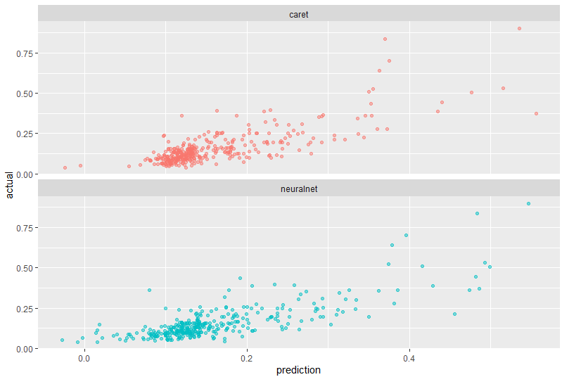

# **Airbnb Price Prediction using Neural Networks and Regression Models**

## **About**
This project presents a **data-driven approach** to predicting Airbnb listing prices in Washington, DC. It leverages **neural networks** (`neuralnet` and `caret-nnet`) and **linear regression models** to optimize pricing strategies. The goal is to enhance price predictions while identifying key factors that influence rental prices.

---

## **Tools & Technologies**
- **Programming Language**: R
- **Libraries**:
  - Data Manipulation: `dplyr`, `tidyverse`, `fastDummies`
  - Machine Learning: `caret`, `neuralnet`
  - Data Visualization: `ggplot2`, `GGally`
  - Statistical Analysis: `car`, `lmtest`
- **Software**: RStudio for development and analysis

---

## **Skills Demonstrated**
### **1. Data Wrangling and Cleaning**
- Merged datasets (`listings` and `reviews`) on relevant keys.
- Handled missing values using mean imputation and logical replacements.
- Encoded categorical variables via **one-hot encoding** for model input.

### **2. Exploratory Data Analysis (EDA)**
- Summarized key features such as **price, neighborhood, and host attributes**.
- Visualized **price distributions** and **correlations between variables**.
- Checked for missing values and potential outliers.

### **3. Data Visualization**
- Created **histograms and density plots** for price distributions.
- Visualized **price variations by neighborhood** using boxplots.
- Used **scatter plots** to compare **predicted vs. actual prices**.

### **4. Predictive Modeling**
- **Neural Networks (neuralnet & caret-nnet)**:
  - Trained models with different hyperparameters, activation functions, and optimizers.
  - Applied **cross-validation** to select optimal network architecture.
- **Linear Regression**:
  - Built traditional regression models for interpretability.
  - Compared performance using **R², RMSE, and MAE**.

### **5. Model Evaluation & Diagnostics**
- **Compared performance** of **neuralnet vs. caret-nnet vs. regression**.
- Assessed **residual plots and R² values** to evaluate fit.
- Checked **multicollinearity using VIF** for better feature selection.

### **6. Business Insights & Recommendations**
- **Superhost status** positively impacts price.
- **Neighborhood selection** (e.g., Georgetown, Dupont Circle) plays a major role in revenue.
- **Dynamic pricing strategies** can further enhance revenue for Airbnb hosts.

---

## **Model Performance**
| Model            | R²  | RMSE   | MAE   |
|-----------------|------|--------|-------|
| **Neuralnet**   | 0.618 | 0.0675 | 0.0448 |
| **Caret-nnet**  | 0.608 | 0.0686 | 0.0454 |
| **Linear Regression** | 0.483 | 0.0939 | 0.0764 |

---

## **Key Visualization**

### **Caret vs. Neural Network**

---

## **Project Outcomes**
✅ **Neural networks outperform regression in predictive accuracy.**  
✅ **Regression provides better interpretability for pricing factors.**  
✅ **A hybrid modeling approach is recommended—use neural networks for prediction, regression for insights.**  
✅ **Airbnb hosts can optimize pricing strategies by incorporating machine learning models.**  

---
